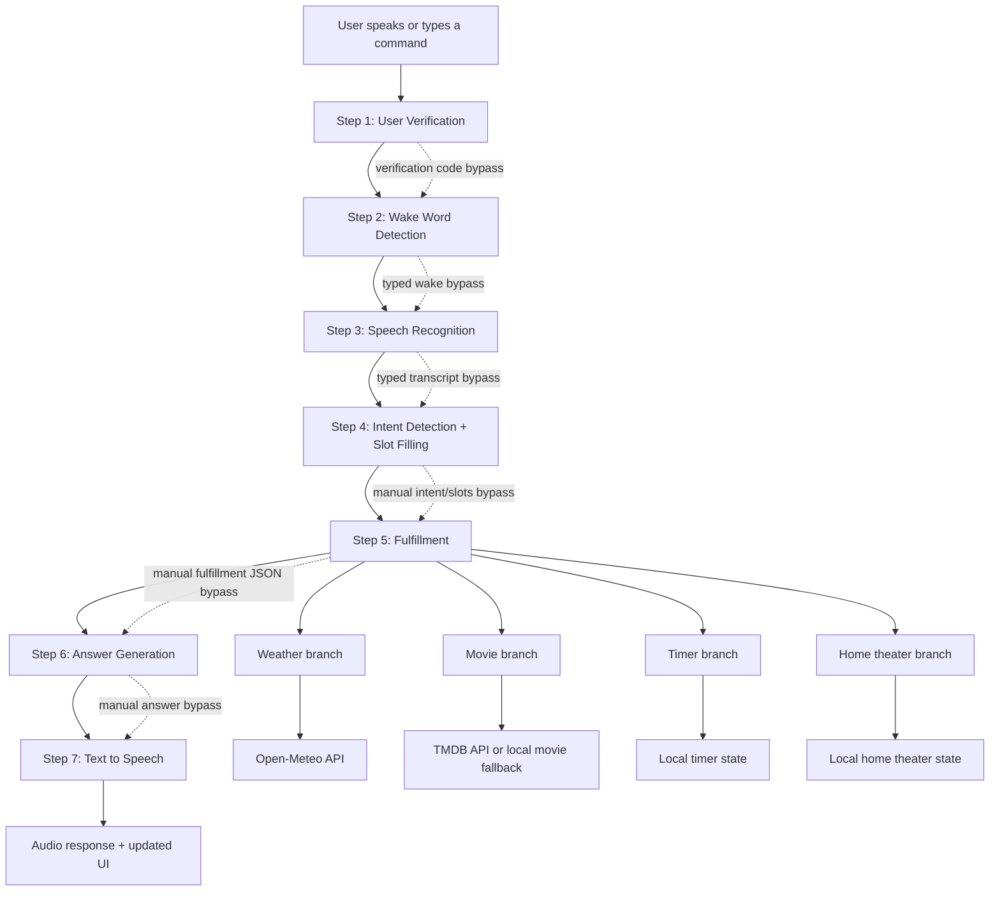
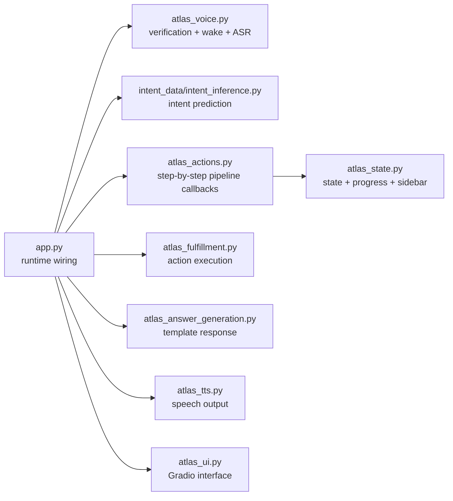

# Atlas Project Architecture

This document explains the project the way a student would present it to a professor:

- what the system does
- how the full pipeline works
- which course ideas we used
- which files implement each part
- which models and APIs we used
- how we met the project expectations

## 1. Project Goal

Atlas is a voice assistant demo for:

- movie information
- weather queries
- timer setting
- home theater control

The project was built as a full end-to-end virtual assistant pipeline, not just one model.

The required path is:

1. user verification
2. wake word detection
3. speech recognition
4. intent detection and slot filling
5. fulfillment
6. answer generation
7. text-to-speech

We also added bypasses at every stage so the demo can still be shown live even if audio, API calls, or one model fails.

## 2. Full System Diagram

## 3. Code Architecture Diagram

## 4. Stage-by-Stage Explanation

### Step 1. User Verification

What this step does:

- It checks who is speaking before Atlas unlocks.

How we implemented it:

- We store enrollment audio for known users in `atlas-voice-data-wav/user_verification/enrollment`.
- For each file, we turn the sound into MFCC features.
- We summarize each recording into a fixed vector using:
  - MFCC means
  - MFCC standard deviations
- We compare the new test recording against saved speaker profiles using cosine similarity.
- If the best score passes the threshold, the user is accepted.

Concepts from the course:

- audio preprocessing
- MFCC features
- speaker verification
- threshold-based decision making

Main files:

- [atlas_voice.py](/home/aristotle/Desktop/VA_Final_Project/Atlas_virtual_assistant/atlas_voice.py)
- [atlas_actions.py](/home/aristotle/Desktop/VA_Final_Project/Atlas_virtual_assistant/atlas_actions.py)

Technical detail:

- This is not a large deep learning speaker model.
- It is a simpler MFCC-based verification pipeline, which is enough for this course demo.

### Step 2. Wake Word Detection

What this step does:

- It checks whether the user said the trigger phrase: `Hey Atlas`.

How we implemented it:

- We keep wake-word data in:
  - `positive` = real wake word
  - `near` = similar-sounding phrases
  - `other` = unrelated words
- We originally had a TensorFlow CNN weights file.
- During debugging, we found that the shipped wake-word model was almost stuck around the same score for all files.
- We trained a better local wake-word model from the project dataset.
- The current runtime now prefers a local tree-based classifier saved as:
  - `wake_word_classifier.pkl`
  - `wake_word_classifier.json`
- It uses MFCC mean/std summary features and a learned threshold.

Concepts from the course:

- wake word detection as binary classification
- audio features
- model evaluation
- threshold tuning

Main files:

- [atlas_voice.py](/home/aristotle/Desktop/VA_Final_Project/Atlas_virtual_assistant/atlas_voice.py)
- [train_wakeword_local.py](/home/aristotle/Desktop/VA_Final_Project/Atlas_virtual_assistant/train_wakeword_local.py)
- [wakeword_diagnostic.py](/home/aristotle/Desktop/VA_Final_Project/Atlas_virtual_assistant/wakeword_diagnostic.py)
- [docs/WAKE_WORD_DIAGNOSTIC.md](/home/aristotle/Desktop/VA_Final_Project/Atlas_virtual_assistant/docs/WAKE_WORD_DIAGNOSTIC.md)

Technical detail:

- Current wake-word model: local `ExtraTreesClassifier`
- Input features: MFCC mean/std summary vector
- Current saved threshold: from `wake_word_classifier.json`
- Fallback still exists: old TensorFlow `wake_word.weights.h5`

### Step 3. Speech Recognition

What this step does:

- It turns spoken command audio into text.

How we implemented it:

- We use Whisper to transcribe the command.
- The current ASR model is `Whisper tiny`.
- If the user does not want to use audio, the UI allows a typed sentence bypass.

Concepts from the course:

- automatic speech recognition
- audio-to-text pipeline

Main files:

- [atlas_voice.py](/home/aristotle/Desktop/VA_Final_Project/Atlas_virtual_assistant/atlas_voice.py)
- [atlas_actions.py](/home/aristotle/Desktop/VA_Final_Project/Atlas_virtual_assistant/atlas_actions.py)

Technical detail:

- Model used: `Whisper tiny`
- Runs locally

### Step 4. Intent Detection and Slot Filling

What this step does:

- It answers two questions:
  - What does the user want?
  - Which key pieces of information did they mention?

Example:

- Input: `does it rain in Ottawa today`
- Intent: `GetWeather`
- Slots:
  - `CITY = Ottawa`
  - `DATE = today`

How we implemented it:

- We created an intent schema and training examples.
- We used BIO tags for slot labels.
- We trained one joint model that predicts both:
  - the intent
  - the slot labels

Concepts from the course:

- intent detection
- slot filling
- BIO tagging
- encoder-only language models
- joint intent + slot prediction

Main files:

- [intent_data/atlas_demo_intents.py](/home/aristotle/Desktop/VA_Final_Project/Atlas_virtual_assistant/intent_data/atlas_demo_intents.py)
- [intent_data/atlas_dataset_builder.py](/home/aristotle/Desktop/VA_Final_Project/Atlas_virtual_assistant/intent_data/atlas_dataset_builder.py)
- [intent_data/train_joint_intent_slot.py](/home/aristotle/Desktop/VA_Final_Project/Atlas_virtual_assistant/intent_data/train_joint_intent_slot.py)
- [intent_data/intent_inference.py](/home/aristotle/Desktop/VA_Final_Project/Atlas_virtual_assistant/intent_data/intent_inference.py)
- [intent_data/joint_intent_slot_model.py](/home/aristotle/Desktop/VA_Final_Project/Atlas_virtual_assistant/intent_data/joint_intent_slot_model.py)

Technical detail:

- Base encoder model: `DistilBERT`
- Specific encoder name: `distilbert-base-uncased`
- Runtime artifacts are loaded from local files in:
  - `intent_data/model_artifacts/atlas_joint_intent_slot`

### Step 5. Fulfillment

What this step does:

- It takes the predicted intent and actually does something useful.

How we implemented it:

- Weather requests call a weather API.
- Movie requests call a movie API if credentials are available.
- If movie credentials are missing, Atlas uses a built-in fallback movie database.
- Timer requests update local timer state.
- Home theater requests update local home theater state shown in the UI.

Concepts from the course:

- fulfillment
- API integration
- local state update
- handling multiple domains

Main file:

- [atlas_fulfillment.py](/home/aristotle/Desktop/VA_Final_Project/Atlas_virtual_assistant/atlas_fulfillment.py)

APIs used:

- `Open-Meteo`
  - geocoding API
  - forecast API
- `TMDB` (The Movie Database)
  - search
  - details
  - credits
  - similar movies
  - discover by genre

Technical detail:

- Weather API:
  - `https://geocoding-api.open-meteo.com/v1/search`
  - `https://api.open-meteo.com/v1/forecast`
- Movie API:
  - `https://api.themoviedb.org/3`
- Optional environment variables:
  - `TMDB_API_KEY`
  - `TMDB_BEARER_TOKEN`

### Step 6. Answer Generation

What this step does:

- It converts the structured action result into a natural sentence the user can understand.

How we implemented it:

- We used template-based answer generation.
- We did not rely on a large chat model for this stage.
- This keeps the output stable and predictable for the demo.

Concepts from the course:

- natural language generation
- template-based response generation
- structured data to text

Main file:

- [atlas_answer_generation.py](/home/aristotle/Desktop/VA_Final_Project/Atlas_virtual_assistant/atlas_answer_generation.py)

Technical detail:

- Output is built from templates based on:
  - intent
  - slots
  - fulfillment result
  - current home theater state

### Step 7. Text-to-Speech

What this step does:

- It speaks the final answer back to the user.

How we implemented it:

- We use `edge-tts` to generate MP3 audio.
- The current voice is `en-CA-ClaraNeural`.

Concepts covered:

- speech output
- final voice assistant response

Main file:

- [atlas_tts.py](/home/aristotle/Desktop/VA_Final_Project/Atlas_virtual_assistant/atlas_tts.py)

Technical detail:

- backend: `edge-tts`
- output format: MP3

## 5. User Interface and Demo Control

We built the app as a guided step-by-step UI instead of one big chat window.

Why:

- it matches the project pipeline
- it makes the demo easy to explain
- it lets the professor see each stage clearly

The UI shows:

- current stage
- current system state
- current intent
- wake state
- home theater state

Main UI files:

- [atlas_ui.py](/home/aristotle/Desktop/VA_Final_Project/Atlas_virtual_assistant/atlas_ui.py)
- [atlas_actions.py](/home/aristotle/Desktop/VA_Final_Project/Atlas_virtual_assistant/atlas_actions.py)
- [atlas_state.py](/home/aristotle/Desktop/VA_Final_Project/Atlas_virtual_assistant/atlas_state.py)

## 6. Bypass Paths We Added

The project needed fallback paths so the demo would still work even if one stage failed.

We included:

- verification code bypass
- wake-word typed bypass
- typed transcript bypass
- manual intent and slot bypass
- manual fulfillment JSON bypass
- manual answer bypass

This is important because a course demo should prove the pipeline, not fail because of one noisy microphone recording.

## 7. Data and Model Assets

### Local data we use

- `atlas-voice-data-wav/user_verification/enrollment`
- `atlas-voice-data-wav/wake_word/positive`
- `atlas-voice-data-wav/wake_word/near`
- `atlas-voice-data-wav/wake_word/other`

### Local model assets we use

- wake-word classifier:
  - `atlas-voice-data-wav/wake_word/wake_word_classifier.pkl`
  - `atlas-voice-data-wav/wake_word/wake_word_classifier.json`
- old wake-word fallback weights:
  - `atlas-voice-data-wav/wake_word/wake_word.weights.h5`
- intent model artifacts:
  - `intent_data/model_artifacts/atlas_joint_intent_slot`

## 8. Where Hugging Face Fits

Hugging Face is not the main runtime brain of the app.

In this project it is mainly used as:

- a fallback place to download the dataset if local data is missing
- the original source for the DistilBERT encoder family used in training

Important point:

- wake word is now local
- user verification is local
- intent inference runs from local artifacts
- ASR runs locally with Whisper

## 9. Course Module Mapping

| Course Module | What we studied | What we implemented in Atlas |
| --- | --- | --- |
| Module 1 | course structure and project overview | full end-to-end assistant planning |
| Module 2 | user verification and neural-network ideas | MFCC-based user verification |
| Module 3 | wake word detection and ASR | local wake-word classifier + Whisper ASR |
| Module 4 | intent detection and slot filling | DistilBERT joint intent-slot model |
| Module 5 | fulfillment and answer generation | weather/movie/home theater fulfillment + template NLG |

## 10. Project Requirements Coverage

This is how Atlas matches the expected project work:

### Requirement: full virtual assistant pipeline

Covered by:

- verification
- wake word
- ASR
- intent + slots
- fulfillment
- answer generation
- TTS

### Requirement: use course concepts, not just one tool

Covered by:

- MFCC features
- cosine similarity
- binary wake-word classification
- speech-to-text
- joint intent-slot model
- API-based fulfillment
- template-based response generation
- TTS output

### Requirement: stable live demo

Covered by:

- step-by-step Gradio UI
- stage-by-stage visibility
- bypass at every important stage
- smoke tests
- local model and local state paths

### Requirement: multiple useful user intents

Covered by:

- mandatory intents:
  - greetings
  - goodbye
  - out-of-scope
  - timer
  - weather
- movie intents:
  - overview
  - rating
  - director
  - cast
  - similar movies
  - discover by genre
- home theater intents:
  - light on/off
  - brightness
  - blinds
  - temperature
  - scene

## 11. Honest Project Summary

If I had to explain this to the professor in one paragraph, I would say:

Atlas is a complete course project virtual assistant that starts from audio, checks the speaker, waits for a wake word, transcribes speech, understands the user request with intent and slot prediction, fulfills the request through APIs or local state changes, generates a natural answer, and speaks it back. We used the course topics from user verification, wake-word detection, ASR, intent detection, slot filling, fulfillment, and answer generation, and we organized the whole thing into a guided Gradio demo with bypasses so every required stage can be shown clearly during evaluation.

## 12. Main Files to Show During Demo

If we need to walk through the code during grading, the best order is:

1. [app.py](/home/aristotle/Desktop/VA_Final_Project/Atlas_virtual_assistant/app.py)
2. [atlas_ui.py](/home/aristotle/Desktop/VA_Final_Project/Atlas_virtual_assistant/atlas_ui.py)
3. [atlas_actions.py](/home/aristotle/Desktop/VA_Final_Project/Atlas_virtual_assistant/atlas_actions.py)
4. [atlas_voice.py](/home/aristotle/Desktop/VA_Final_Project/Atlas_virtual_assistant/atlas_voice.py)
5. [intent_data/intent_inference.py](/home/aristotle/Desktop/VA_Final_Project/Atlas_virtual_assistant/intent_data/intent_inference.py)
6. [atlas_fulfillment.py](/home/aristotle/Desktop/VA_Final_Project/Atlas_virtual_assistant/atlas_fulfillment.py)
7. [atlas_answer_generation.py](/home/aristotle/Desktop/VA_Final_Project/Atlas_virtual_assistant/atlas_answer_generation.py)
8. [atlas_tts.py](/home/aristotle/Desktop/VA_Final_Project/Atlas_virtual_assistant/atlas_tts.py)
